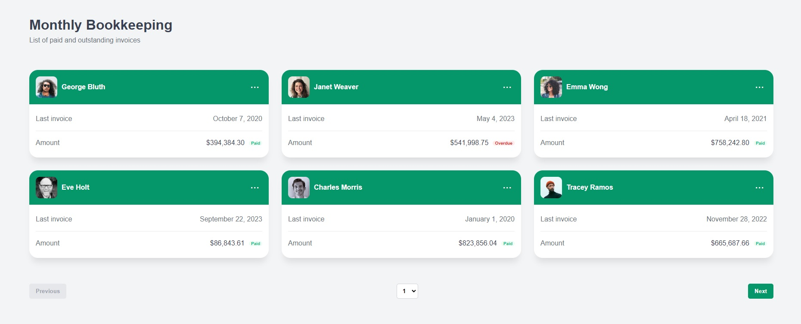
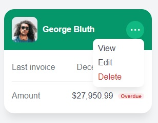
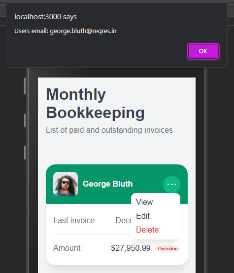

#  Monthly Bookkeeping | Financial-Cents

* The app generates random **Dates**, **Invoice Amounts** and **Invoice Statuses**.
* The Random Dates range is set from **March 1 2020** *(Financial Cents founded date)* - **current**.
* Contains Api loading Animation. *(Try on **Fast 3G** or **Slow 3G** throttling)*
* Contains a **paginator** that will has a disabled animation while api is loading.
* App is responsive on **Monitor**, **Tablet** and **Mobile screens**.
* **View**, **Edit**, and **Delete** dropdown menu options will reveal the email of the user.
### Loading Animation

### Loading Avatar Animation

### Mobile Responsive

### Dropdown Menu

### Dropdown Data Notifications

