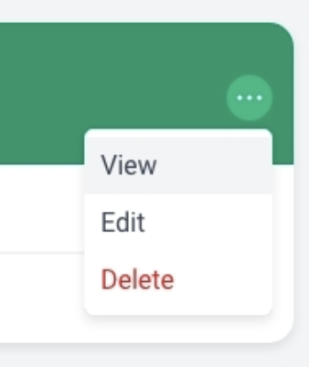

# Financial Cents Challenge

In this coding test, you will create a simple interface that shows a list of client invoices. Please read this document to the end before getting started as it contains helpful notes on which tools are available to use. Here is a screenshot of the final design that you'll need to recreate.

### Requirements
- [ ] Use any JS and CSS frameworks that you are comfortable with
- [ ] The design should be responsive. On smaller devices, the list of cards should stack vertically.
- [ ] Load a list of users (clients) from `https://reqres.in/api/users?page=1`
  - You may use `fetch` or any JS library that you're comfortable with
- [ ] Implement paging support
- [ ] Implement appropraite hover, focus and active states for interactive elements as you see fit
- [ ] Randomly generate dates, invoice amounts and invoice status for each client
- [ ] Implement dropdown including open/close JS logic
  - Make sure that clicking outside the dropdown, closes the dropdown.
  - Please attempt to create this without using any external libraries.
  - 

### Code Submission
Please feel free to either email the code as a zip file or submit it to git repository (Github, Gitlab or BitBucket) and share the link.

### Notes
You may use npm or any other package manager to manage dependencies. You are also allowed to use boilerplate/template providers such as vite, create-react-app, etc.

# Resources

### Color Palette (from darkest to lightest)
Grays:
- #374151
- #6B7280
- #9CA3AF
- #D1D5DB
- #E5E7EB
- #F3F4F6

Reds:
- #DD1C1A
- #FEEBEB

Greens:
- #059669
- #10B981
- #ECFDF5

(Image showing color palette can be found in screenshots/colors.png)

### Questions
If you have any questions or require assistance, please don't hesitate to reach out to us. We're happy to answer any questions regarding this test.

Thank you for the taking the time to complete this test! Looking forward to hearing back from you.
